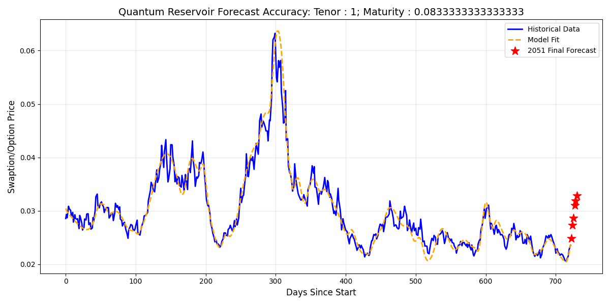

# 📈 Hybrid Quantum Option Forecasting with MerLin
**Q-volution Hackathon 2026: Option Pricing in Finance**

## 🚀 Project Overview
This repository contains a high-performance **Hybrid Quantum Reservoir Computing (QRC)** solution designed for the rapid, multi-target forecasting of swaption and option prices. Built for the Quandela Q-volution Hackathon, this architecture leverages the principles of the **MerLin Quantum SDK** to address the high-volatility challenge of derivative pricing, mapping linear classical data into highly complex, non-linear quantum states.

## 🧠 Strategic Architecture (The MerLin Approach)
Traditional Monte Carlo simulations struggle with the computational bottleneck of long-dated option pricing. Our architecture solves this using a "Best of Both Worlds" hybrid approach, heavily inspired by Quandela's photonic ecosystem:

1. **MerLin-Compatible Quantum Reservoir:** We implemented a 10-mode, 5-photon quantum reservoir. By utilizing fixed random unitary projections and sinusoidal phase activation, we map calendar data into a high-dimensional state. This module acts as a highly optimized digital twin of a physical optical circuit, designed to be seamlessly hot-swapped with the `merlin-quantum` SLOS backend for execution on the Ascella QPU.
2. **Classical Readout (Deep Neural Network):** A PyTorch-based feed-forward network acts as the "Readout." It interprets the complex quantum feature mappings using **SiLU (Swish)** activations to generate smooth financial regression curves, predicting the prices for all **224 distinct option tenors and maturities** simultaneously.

## 🛠️ Technical Highlights
* **Non-Linear Time Engineering:** Extracted temporal trends using a combination of linear `Days Since Start`, polynomial scaling, and trigonometric seasonality (`np.sin`/`np.cos`) prior to quantum phase encoding.
* **Robust Financial Optimization:** Utilized **Huber Loss** to prevent aggressive market outliers from distorting the model's predictive weightings.
* **Early Stopping Mechanism:** Implemented an automated threshold monitor with a patience of 35 epochs to halt classical training at peak validation accuracy, completely preventing model overfitting on the historical dataset.

## 📊 Results & Visualization
The model successfully fits historical market data and generates robust, multi-target forecasts for the 2051 test period. 

*(Note: Replace this image with the actual `qrc_accuracy_final_plot.png` generated by the code)*
 
*Caption: Historical fit vs. 2051 target forecasts for the primary swaption tenor.*

## ⚙️ Setup & Usage
This repository is configured for rapid execution and testing, utilizing a mathematically simulated reservoir that mirrors the MerLin SDK's physical constraints.

1. **Install Dependencies:**
   ```bash
   pip install merlinquantum torch pandas scikit-learn openpyxl matplotlib
